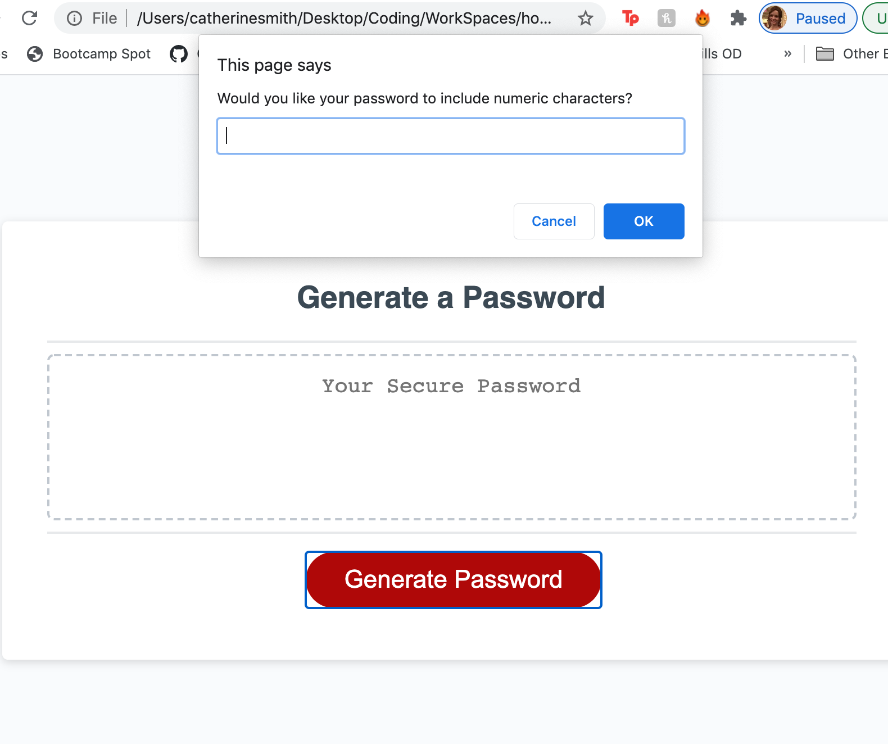
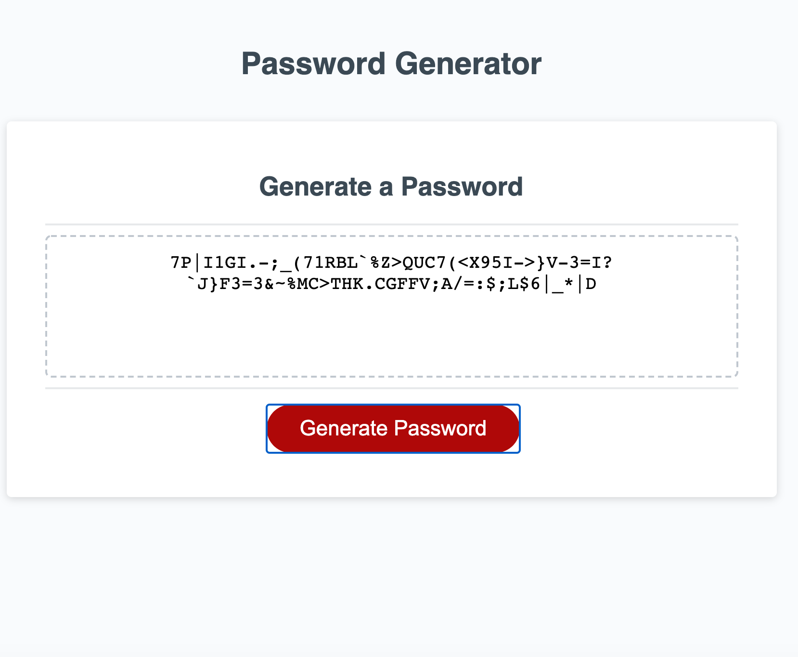

# Password Generator
This application randomly generates and prints a password for users. It uses a series of prompts to ask if the user would like to include uppercase letters, lowercase letters, numbers, and/or special characters.

## Technologies Used:
HTML
CSS
JavaScript

## User Story

```
AS AN employee with access to sensitive data
I WANT to randomly generate a password that meets certain criteria
SO THAT I can create a strong password that provides greater security
```

## Acceptance Criteria

```
GIVEN I need a new, secure password:
1. WHEN I click the button to generate a password,
    THEN I am presented with a series of prompts for password criteria.
2. WHEN prompted for password criteria,
    THEN I select which criteria to include in the password.
3. WHEN prompted for the length of the password, 
    THEN I choose a length of at least 8 characters and no more than 128 characters.
4. WHEN prompted for character types to include in the password,
    THEN I choose lowercase, uppercase, numeric, and/or special characters.
5. WHEN I answer each prompt,
    THEN my input should be validated and at least one character type should be selected.
6. WHEN all prompts are answered,
    THEN a password is generated that matches the selected criteria.
7. WHEN the password is generated,
    THEN the password is either displayed in an alert or written to the page.
```
Note: I tried altering the HTML to present a more practical user interface, wherein, instead of clicking “OK” or “Cancel” in a series of window confirm and/or prompt methods to determine what type of components they want in a password, users could uncheck a checkbox if they do not wish to include special characters (symbols), numbers, uppercase letters, or lowercase letters in their randomly generated password. They could also type, use the arrows, or use the slidebar to indicate how long they want their password to be.  However, I did not get a chance to finish debugging what was going wrong. This progress is saved in the TryLater file.  The code that works is found in the Develop and main folder.

```
```
## Mock Up

The following images showcase the web application's appearance and functionality:



```
```

## Link to deployed application
[Deplpoyed application](https://crsmith01.github.io/homework-3-password-generator/)


### Contact:
* [Catherine Smith](https://github.com/crsmith01)


## License
 
Copyright 2021 Catherine Smith

Permission is hereby granted, free of charge, to any person obtaining a copy of this software and associated documentation files (the "Software"), to deal in the Software without restriction, including without limitation the rights to use, copy, modify, merge, publish, distribute, sublicense, and/or sell copies of the Software, and to permit persons to whom the Software is furnished to do so, subject to the following conditions:

The above copyright notice and this permission notice shall be included in all copies or substantial portions of the Software.

THE SOFTWARE IS PROVIDED "AS IS", WITHOUT WARRANTY OF ANY KIND, EXPRESS OR IMPLIED, INCLUDING BUT NOT LIMITED TO THE WARRANTIES OF MERCHANTABILITY, FITNESS FOR A PARTICULAR PURPOSE AND NONINFRINGEMENT. IN NO EVENT SHALL THE AUTHORS OR COPYRIGHT HOLDERS BE LIABLE FOR ANY CLAIM, DAMAGES OR OTHER LIABILITY, WHETHER IN AN ACTION OF CONTRACT, TORT OR OTHERWISE, ARISING FROM, OUT OF OR IN CONNECTION WITH THE SOFTWARE OR THE USE OR OTHER DEALINGS IN THE SOFTWARE.